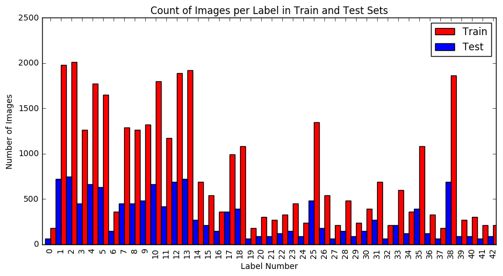
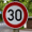

# **Traffic Sign Recognition** 

## **Introduction**

The goal this project was to create a model capable of accurately classifying images of German traffic signs. In order to accomplish this goal, the following tasks were performed:

- Load, summarize, and explore the sample image data set used for the analysis.
- Design, train, validate and test a model architecture that was capable classifying the sample data validation set to 93% accuracy.
- Use the model to make predictions on a new set of images downloaded separately from the Internet.
- Analyze the confidence of the predictions on this new data set.

A summary of the work done for each of these tasks, along with a discussion of the results obtained, is contained in the sections that follow. Throughout these sections, references to a corresponding Jupyter notebook will be made. This notebook (CarND-Traffic-Sign-Classifier-Project.ipynb) can be found within the same GitHub repository that contained this writeup.

### Data Set Summary & Exploration

#### 1. Summary of the data set

The data set used for this analysis was derived from the data made available at the [INI Benchmark Website](http://benchmark.ini.rub.de/?section=gtsrb&subsection=dataset). This was a set of images obtained from actual video that was recorded while driving on German streets. There are 43 different types of signs contained within roughly 50,000 images. For convenience, pickled versions of this source data set, that partitioned the data into training, validation, and test sets were provided. These pickled data sets also transformed each image into a 32x32 pixel RGB format. From these data sets some basic statisitics were retrieved in order to get a better understanding of the data contents. This analysis can be found in the Jupyter notebook in analysis cells under the heading ' Step 1: Dataset Summary & Exploration' and sub-heading 'Provide a Basic Summary of the Data Set Using Python, Numpy and/or Pandas'

This analysis revealed the following characteristics of the data set

* **The size of training set was 34799.**
* **The size of validation set was 4410.**
* **The size of test set is 12630.**
* **The shape of a traffic sign image is (32, 32, 3) - (Height, Width, Channels).**
* **There were 43 unique classes/labels in the data set.**

####2. Exploratory visualization of the dataset.

Beyond the basic data set characteristics given above, we went one step further to get an understanding of how the images were distributed across the classification labels. Knowing this information could inform the design of the model in subsequent steps. This analysis can be found in the Jupyter notebook in analysis cells under the heading ' Step 1: Dataset Summary & Exploration' and sub-heading 'Include an exploratory visualization of the dataset'

The bar chart given below shows that certain labels defintely appear more frequently than others within the data set. We can also make a subjective conclusion that both the training and test data sets have similar distributions of the labels. Therefore, we can conclude that a model derived from the training set should be able to perform somewhat similarly on the test set.

### Model Architecture - Design and Test

#### 1. Image Pre-Processing

Image pre-processing was performed in order to improve model performance. As such, the pre-processing steps were performed iteratively, with additional steps added until acceptable model performance was achieved.

First, images were converted from RGB to grayscale. This was done to simplify the input to model, which would reduce the number of model parameters required and also minimize slight color differences for images of the same label.

Second, grayscale values were normalized between 0 and 1. This was done in order to help optimizer performance by minimizing the spread in greyscale values across images.

Normalized values were then centered on the mean. Again, this was done to condition the input as much as possible to help minimize the amount of extra work the optimizer needed to do.

Finally, the order of images was randomized before each training epoch using the scikit-learn shuffle function.

The code for this step is contained in the Jupyter notebook in analysis cells under the heading ' Step 2: Design and Test a Model Architecture' and sub-heading 'Pre-process the Data Set'. A 'pre-process' function was written and used to pre-process the training, validation, test, and new data sets before passing them to the model for classification.

#### 2. Training, Validation, and Test Data Sets

As mentioned above training, validation, and test data sets were provided. Therefore, there was not a significant amount of work to be done for this step. The setup for each data set is contained in the Jupyter notebook under the heading 'Step 0: Load The Data'

My final training set had 34799 number of images. My validation set and test set had 4410 and 12630 number of images, respectively. Multiple cross-validation sets might have been produced using a k-folds approach, but in the interest of simplicity, and the fact that the model performed sufficiently without resorting to this, this approach was not taken in this analysis.

I also chose not to augment the dataset with manufactured or "fake" data as I don't particurlarly see the value in doing this. Data generated from existing data, theoretically, adds no new information to the model. Also, if one is not careful, it would seem to be possible to adversely affect the distribution of labels if manufactured data were introduced.

#### 3. Description of the final model architecture

The code for this step is contained in the Jupyter notebook in analysis cells under the heading 'Step 2: Design and Test a Model Architecture' and sub-heading 'Pre-process the Data Set'

My final model was heavily influenced by the LenNet architecture and consisted of the following layers:

| Layer         		|     Description	        					|
|:----------------------|:----------------------------------------------|
| Input         		| 32x32x1 Grayscale image   					|
| Convolution 5x5     	| 1x1 stride, valid padding, outputs 28x28x6 	|
| RELU					|												|
| Max pooling	      	| 2x2 stride,  outputs 14x14x6 			     	|
| Convolution 5x5	    | 1x1 stride, valid padding, outputs 10x10x16   |
| RELU					|												|
| Max pooling	      	| 2x2 stride,  outputs 5x5x16 			     	|
| Flatten       		| outputs 400        							|
| Fully connected		| outputs 120                                   |
| RELU					|		       					       			|
| Fully connected		| outputs 84        							|
| RELU					|		       					       			|
| Dropout				| 50% keep probability 			       			|
| Fully connected		| outputs 43        							|
| Softmax				|              									|

As mentioned, this is very similar to the LetNet architecture with the addition of a dropout layer before the final output layer (with care to make sure it is only effective during training). This was added to help minimize overfitting of the training set.

#### 4. Model Training.

The code for training the model is located in the Jupyter notebook in analysis cells under the heading 'Step 2: Design and Test a Model Architecture' and sub-heading 'Train, Validate and Test the Model'

To train the model, I used the AdamOptimizer to minimize the softmax cross entropy of the model output. The Adam optimizer was chosen in hopes that it's features that provide 'momentum' would allow it find a solution while being less likely to get caught in a local minimum than the standard GradientDescentOptimizer. From there, the number of epochs, batch size, and learning rate were chosen iteratively and the final values represent the combination of values that allowed the model to achieve the best accuracy performance in the minimum number of epochs. To summarize, the final model training parameters chosen are given in the following table.

| Parameter         	|     Final Value    |
|:----------------------|:------------------:|
| Epochs         		| 10  			     |
| Batch Size          	| 64 	             |
| Learning Rate			| 0.001			     |

#### 5. Model Development.

The code for training the model is located in the Jupyter notebook in analysis cells under the heading 'Step 2: Design and Test a Model Architecture' and sub-heading 'Train, Validate and Test the Model'. Accuracy calculations occur, specifically in the last two cells of this section.

My final model results were:

* **Training set accuracy of 0.995**
* **Validation set accuracy of 0.945**
* **Test set accuracy of 0.922**

As mentioned above, the LeNet model was chosen as the initial design for the model. This was chosen due to its convolutional nature. Given that we would be trying to classify common traffic signs in multiple images, where the same basic features, such as edges, shapes, groupings of shapes, of each sign may appear slightly differently in the images, a convolutional approach seemed appropriate. It also greatly helped that the traffic sign test images had the same pixel dimension and color depth (after pre-processing) as the MNIST images. This provided a good starting point for choosing convolution filter and max pooling dimensions. A test run was performed with the base LeNet architecture, and this run showed sub-standard accuracy performance on the validation set and also indicated some level of over-fitting as the validation set accuracy was several points lower than the test set. From here, basic changes to image pre-processing were applied, which improved validation accuracy somewhat, but did not remedy the over-fitting issue. To address the over-fitting issue several things were tried, including, changing the total number of layers, changing filter sizes, adjusting the output size of each fully connected layer, and adding a dropout layer between the fully-connected layers. The addition of the dropout layer improve produced the greatest reduction in the overfitting issue so it was chosen for the final architecture. The location of the dropout within the fully connected layers had minimal impact, but locating it before the final output layer seemed to make the most intuitive sense so that is where it was located in the final architecture. The final keep probability was aggressively chosen, but proved to produce the best accuracy. With all that said, despite sufficient performance on the validation set, the over-fitting was never completely removed. As mentioned above, I believe that instead of trying to address this with the model architecture, splitting up the training set into multiple cross-validation sets using a k-folds approach or potentially increasing the size of the validation set (while reducing the size of the training set) might have had produced better results to further reduced the over-fitting. Another possibility for reducing the over-fitting would have been to add regularization to loss function.

### Test a Model on New Images

#### 1. Collect Five German traffic signs from the web

Five German traffic signs were retrieved from the Internet using a standard image search. The images that were selected were chosen for the clarity of the sign and the absence of any kind of watermarking (which proved to be a challenge). The five signs and their associated image and labels (in parentheses) that were chosen are as follows

**30kph Speed Limit (1)**   
**Children Crossing (28)**   
**Roundabout (40)**   
**Stop (14)**   
**Turn Right Ahead (33)**   

Once images were selected, they were resized to 32x32 pixels and converted to the RGB colorspace. In general, these images should be fairly straightforward to classify as they are fairly pristine. That is, with the exception of the first image they are straight-on views of the road sign with very little skew, color deviation or background noise. This, of course, assumes that the model has learned to ignore these factors during classification. The first image may be more difficult to classify as it does include background noise and shading on the sign itself.

The code for managing the import of new images is found in the Jupyter notebook in analysis cells under the heading 'Step 3: Test a Model on New Images' and sub-heading 'Load and Output the Images'.

#### 2. New model prediction

The code for classifying the new images can be found in the Jupyter notebook in analysis cells under the heading 'Step 3: Test a Model on New Images' and sub-heading 'Predict the Sign Type for Each Image'

The results of the prediction are as follows:

| Image			        |     Prediction	        					|
|:----------------------|:----------------------------------------------|
| 30kph Speed Limit    	| 30kph Speed Limit   							|
| Children Crossing    	| Children Crossing 							|
| Roundabout			| Roundabout									|
| Stop	      	      	| Stop					 	          			|
| Turn Right Ahead		| Turn Right Ahead      						|

The model was able to correctly guess 5 of the 5 traffic signs, which gives an accuracy of 100%. This, obviously, was on the order of what was expected given the accuracy of the training, validation, and test sets.

#### 3. Certainty of Model Predictions on New Images

The code showing prediction accuracy and confidence for the new images can be found in the Jupyter notebook in analysis cells under the heading 'Step 3: Test a Model on New Images' and sub-headings 'Analyze Performance' and 'Output Top 5 Softmax Probabilities For Each Image Found on the Web'

##### 30kph Speed Limit - Softmax probability

For the 30kph Speed Limit image, the model is slightly sure that this is a 30kph Speed Limit sign (probability of 0.54), and the image does contain a 30kph Speed Limit sign. The top five soft max probabilities were:

| Probability         	|     Prediction	        					|
|:----------------------|:----------------------------------------------|
| 5.37398100e-01        | 1 - 30kph Speed Limit   						|
| 4.62555379e-01     	| 2 - 50kph Speed Limit							|
| 4.50176558e-05		| 3 - 60kph Speed Limit							|
| 1.47699700e-06	    | 5 - 80kph Speed Limit					 		|
| 4.73866363e-11		| 15 - Yield      							    |

##### Stop - Softmax probability

For the Stop image, the model is very sure that this is a stop sign (probability of 0.83), and the image does contain a stop sign. The top five soft max probabilities were

| Probability         	|     Prediction	        					|
|:----------------------|:----------------------------------------------|
| 8.28190088e-01        | 14 - Stop   							        |
| 1.55861080e-01     	| 8 - 120 kph Speed Limit 						|
| 1.49630122e-02		| 2 - 50 kph Speed Limit						|
| 8.42884416e-04	    | 4 - 70 kph Speed Limit					 	|
| 1.31976471e-04		| 15 - No Vehicles     							|

##### Turn Right Ahead - Softmax probability

For the Turn Right Ahead image, the model is absolutely sure that this is a Turn Right Ahead sign (probability of 1.0), and the image does contain a Turn Right Ahead sign. The top five soft max probabilities were

| Probability         	|     Prediction	        					|
|:----------------------|:----------------------------------------------|
| 1.0         			| 33 - Turn Right Ahead   						|
| 3.22184901e-09     	| 1 - 30kph Speed Limit							|
| 6.05238732e-12		| 11 - Right-of-way at the next intersection	|
| 5.89465239e-12	    | 14 - Stop					 		    		|
| 3.86949003e-15		| 25 - Road Work      							|

##### Roundabout - Softmax probability

For the Roundabout image, agin the model is absolutely sure that this is a Roundabout sign (probability of 0.99), and the image does contain a Roundabout sign. The top five soft max probabilities were

| Probability         	|     Prediction	        					|
|:----------------------|:----------------------------------------------|
| 9.99836683e-01        | 40 - Roundabout 							    |
| 1.61768752e-04     	| 11 - Right-of-way at the next intersection	|
| 9.70686870e-07		| 1 - 30kph Speed Limit							|
| 3.74547000e-07	    | 12 - Priority Road			 				|
| 1.28573106e-07		| 7 - 100 kph Speed Limit						|

##### Children Crossing - Softmax probability

For the Childred Crossing image, once again the model is absolutely sure that this is a Children Crossing sign (probability of 1.0), and the image does contain a Children Crossing sign. The top five soft max probabilities were

| Probability         	|     Prediction	        					|
|:----------------------|:----------------------------------------------|
| 1.0         			| 28 - Children Crossing						|
| 3.96120612e-08     	| 20 - Dangerous curve to the right				|
| 2.11690954e-09		| 23 - Slippery road							|
| 2.37768583e-10	    | 30 - Beware of ice/snow		 				|
| 7.49340243e-11		| 29 - Bicycle Crossing							|

As expected, the clarity of the images allowed the model to be fairly confident of its predictions for all but the first image.